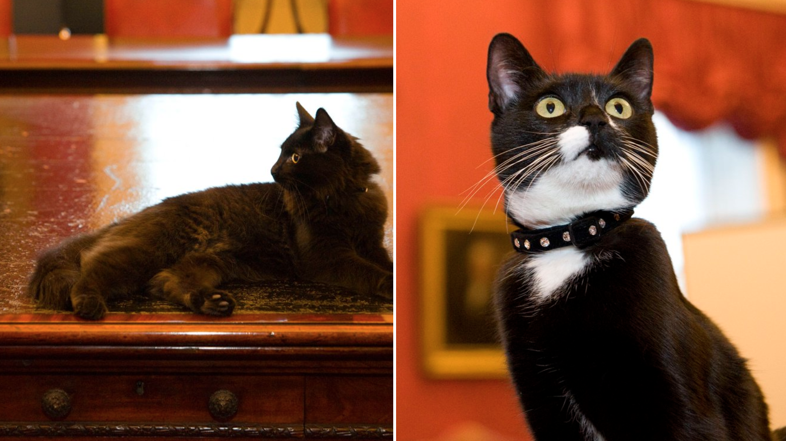
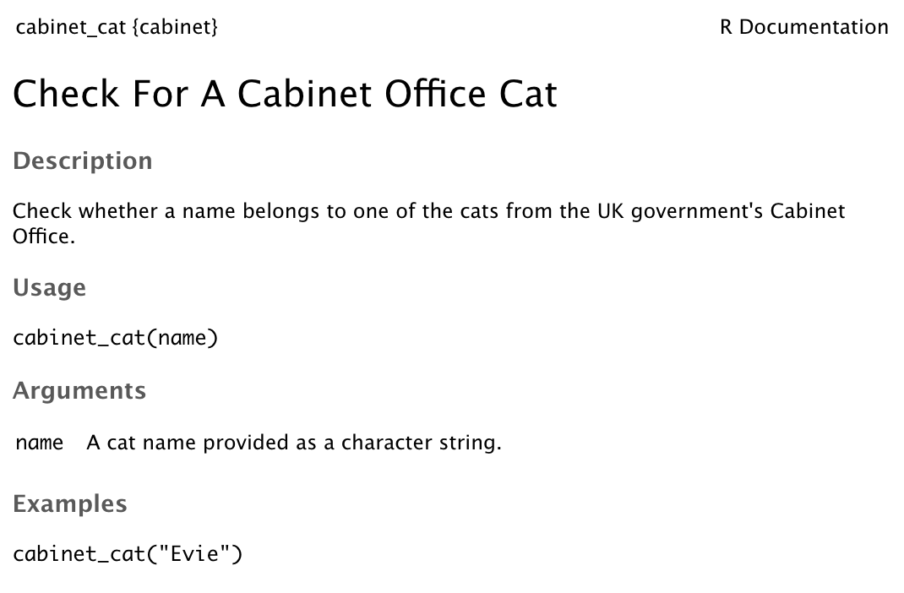

---
output:
  xaringan::moon_reader:
    css: ["default", "gds.css", "gds-fonts.css"]
    seal: false
    lib_dir: libs
    nature:
      highlightStyle: github
      highlightLines: true
      countIncrementalSlides: false
---
class: title-slide, bottom

.bold[Matt Dray]

Associate Data Scientist

Government Digital Service

[@mattdray](https://www.twitter.com/mattdray) | [rostrum.blog](https://rostrum.blog)
---
class: inverse, middle

Make an R package the easy way
???
* What do I mean by easy?
* I mean you can write the whole thing from scratch, which uses multiple files and languages
* Or you can use some shortcuts thanks to some packages
---
class: middle

Name these cats
<center></center>
???
* Ossie (left) and Evie (right): the Cabinet Office cats
* It will become obvious why I've mentioned this
---
class: middle

Who has:

* used R?
* written a function?
* written a package?
* used {usethis} to write a package?
---
class: middle

What _is_ a function?

Why make one?
???
* A command that does a thing
* Prevents you repeating yourself
* Abstracts away a bunch of code
* Written in a special format
---
class: middle

What _is_ a package?

Why make one?
???
* A collection of functions (usually)
* Themed to perform certain type of task (usually), like plotting
* You use them all the time; basically anything in the form `x()`
* You pass arguments to supply information for the function to work or to alter its behaviour
---
class: inverse, middle
background-image: url("img/hex_small.jpg")
background-size: cover
???
* Some packages are built into R already; you can install more
* Examples: {readr} to read files, {parsnip} for model fitting, {xaringan} to create slides
* Image by Amelia McNamara
---
class: inverse, middle

Minimal example
???
* Let's build a simple, pointless package to illustrate the process
---
class: middle

Install and load packages

```{r eval=FALSE}
install.packages("devtools", "usethis")

library(devtools)
library(usethis)
```
???
* {devtools} is a general purpose package for developing packages
* {usethis} is a package of functions for setting up your own package
---
class: middle

Generate package folder and content with `create_package()`

```{r eval=FALSE}
usethis::create_package("~/Desktop/cabinet")

# ✔ Setting active project to '/Users/matthewdray/Desktop/cabinet'
# ✔ Creating 'R/'
# ✔ Creating 'man/'
# ✔ Writing 'DESCRIPTION'
# ✔ Writing 'NAMESPACE'
# ✔ Writing 'cabinet.Rproj'
# ✔ Adding '.Rproj.user' to '.gitignore'
# ✔ Adding '^cabinet\\.Rproj$', '^\\.Rproj\\.user$' to '.Rbuildignore'
# ✔ Opening new project 'cabinet' in RStudio
```
???
* A package is a folder containing a bunch of files; `create_package()` creates these for you
* Some of the files contain the functions, other files are for documentation, for example
* If you run the line from within RStudio, it automatically creates an RStudio (.Rproj) file for your new package and opens it
---
class: middle

The file tree produced by `create_package()`

```{r eval=FALSE}
cabinet/
  ├── man/
  ├── R/
  ├── cabinet.Rproj
  ├── DESCRIPTION
  └── NAMESPACE
```
???
* This is the basic package folder skeleton created by `create_package()`
* We can add to/edit `R/` and `DESCRIPTION`
* Don't touch `man/` and `NAMESPACE`; we can use functions later to fill these for us
---
class: middle

Create a script file for functions with `use_r()`

```{r eval=FALSE}
usethis::use_r("felines")

# ✔ Setting active project to '/Users/matthewdray/Desktop/cabinet'
# ● Modify 'R/felines.R'
```
???
* Obviously we need to add functions to our package
* They go in R script files in the `R/` folder
* `use_r()` creates a script file with the provided string argument as its name
* It will open automatically in RStudio
* You would typically create multiple script files, where functions with the same 'theme' go in the same script file
---
class: middle

`use_r()` created the script file in the `R/` folder

```{r eval=FALSE}
cabinet/
  ├── man/
  ├── R/
  |   └── felines.R #<<
  ├── cabinet.Rproj
  ├── DESCRIPTION
  └── NAMESPACE
```
???
* Here's where our script file went
---
class: middle

Add functions to `R/felines.R`

```{r eval=FALSE}
cabinet_cat <- function(name) {

  if (name %in% c("Ossie", "Evie")) {
    cat(paste(name, "is a good Cabinet Office kitty."))
  } else if (name %in% c("Palmerston", "Larry", "Gladstone")) {
    cat(paste(name, "isn't a Cabinet Office cat!"))
  } else {
    cat("You've much to learn about government cats.")
  }

}
```
???
* Just going to add one silly one now
* This isn't function-writing best practice, but will do for now
* What does this function do?
---
class: middle

Document the package

```{r eval=FALSE}
devtools::document()

# Updating cabinet documentation
# Updating roxygen version in /Users/matthewdray/Desktop/cabinet/DESCRIPTION
# Writing NAMESPACE
# Loading cabinet
```
---
class: middle

Now you can use the `cabinet_cat()` function from the {cabinet} package! 

```{r eval=FALSE}
cabinet_cat("Ossie")

# Ossie is a good Cabinet Office kitty.

cabinet_cat("Gladstone")

# Gladstone isn't a Cabinet Office cat!

cabinet_cat("Garfield")

# You've much to learn about government cats.
```
???
* We could stop here, but this isn't that useful
* What's missing?
* Obviously more functions, but also the documentation for them
* People can't use the functions if they don't know what they do or how to use them
---
class: inverse, middle

Add basic documentation
---
class:middle

Add documentation for:

* the package
* each function

So that `?cabinet` and `?cabinet_cat` call help files

---
class:middle

Documentation theory:

* Edit `DESCRIPTION` > `use_package_doc()` > `document()` > `.Rd` > `?cabinet`
* Add roxygen > `document()` > `.Rd` > `?cabinet_cat`

---
class: middle

Edit the `DESCRIPTION` file

```{r eval=FALSE}
Package: cabinet
Title: A Silly Package To Demonstrate How To Build Packages #<<
Version: 0.0.0.9000
Authors@R: #<<
    person(given = "Matt", #<<
           family = "Dray", #<<
           role = c("aut", "cre"), #<<
           email = "matthew.dray@digital.cabinet-office.gov.uk") #<<
Description: A package created for a Cabinet Office Coffee & Coding session that #<<
    doesn't do anything useful in particular. #<<
License: What license it uses
Encoding: UTF-8
LazyData: true
RoxygenNote: 6.1.1
```
???
* The `DESCRIPTION` file describes the package: what, who, etc
* You can adapt and add to this template
* For now, just update the highlighted lines
* We can deal with other additions later
---
class: middle

`use_package_doc()` creates documentation about the package from the `DESCRIPTION`

```{r eval=FALSE}
usethis::use_package_doc()

# ✔ Writing 'R/cabinet-package.R'

devtools::document()

# Updating cabinet documentation
# Loading cabinet
# Writing cabinet-package.Rd
```
---
class: middle

`use_package_doc()` generated an `.Rd` documentation file for the package

```{r eval=FALSE}
cabinet/
  ├── man/
  |   └── cabinet-package.Rd #<<
  ├── R/
  |   └── felines.R
  ├── cabinet.Rproj
  ├── DESCRIPTION
  └── NAMESPACE
```
---
class: middle

It's in a special format that can be rendered as a help file

```{r eval=FALSE}
% Generated by roxygen2: do not edit by hand
% Please edit documentation in R/cabinet-package.R
\docType{package}
\name{cabinet-package}
\alias{cabinet}
\alias{cabinet-package}
\title{cabinet: What the Package Does (One Line, Title Case)}
\description{
What the package does (one paragraph).
}
\author{
\strong{Maintainer}: First Last \email{first.last@example.com}

}
\keyword{internal}

```
???
* It would've been a pain to write this by hand
* The `.Rd` extension is 'roxygen documentation'
* It's in a kind of LaTeX implementation
---
class: middle

Add roxygen comments above each function

```{r}
#' @title Check For A Cabinet Office Cat
#'
#' @description Check whether a name belongs to one of the cats from the UK
#'     government's Cabinet Office.
#' @param name A cat name provided as a character string.
#' @export
#' @examples
#' cabinet_cat("Evie")
```

---
class: middle

And `document()` again

```{r eval = FALSE}
devtools::document()

# Updating cabinet documentation
# Loading cabinet
# Writing NAMESPACE
# Writing cabinet_cat.Rd
```

---
class: middle

The function's roxygen code was converted to an `.Rd` documentation file

```{r eval=FALSE}
cabinet/
  ├── man/
  |   ├── cabinet-package.Rd
  |   └── cabinet_cat.Rd #<<
  ├── R/
  |   └── felines.R
  ├── cabinet.Rproj
  ├── DESCRIPTION
  └── NAMESPACE
```
---
class: middle
```{r eval=FALSE}
?cabinet_cat
```
<center></center>


---
class: title-slide, bottom

.bold[Thanks!]

<br>

Matt Dray

[@mattdray](https://www.twitter.com/mattdray) | [rostrum.blog](https://rostrum.blog)
---
class: middle

Check package name

```{r eval=FALSE}
available::available("cabinet")

# Urban Dictionary can contain potentially offensive results,
#   should they be included? [Y]es / [N]o:

1: Y

# ── cabinet ────────────────────────────────────────────────
# Name valid: ✔
# Available on CRAN: ✔ 
# Available on Bioconductor: ✔
# Available on GitHub:  ✔ 
# Abbreviations: http://www.abbreviations.com/cabinet
# Wikipedia: https://en.wikipedia.org/wiki/cabinet
# Wiktionary: https://en.wiktionary.org/wiki/cabinet
# Urban Dictionary:
#   Not found.
# Sentiment:???
```