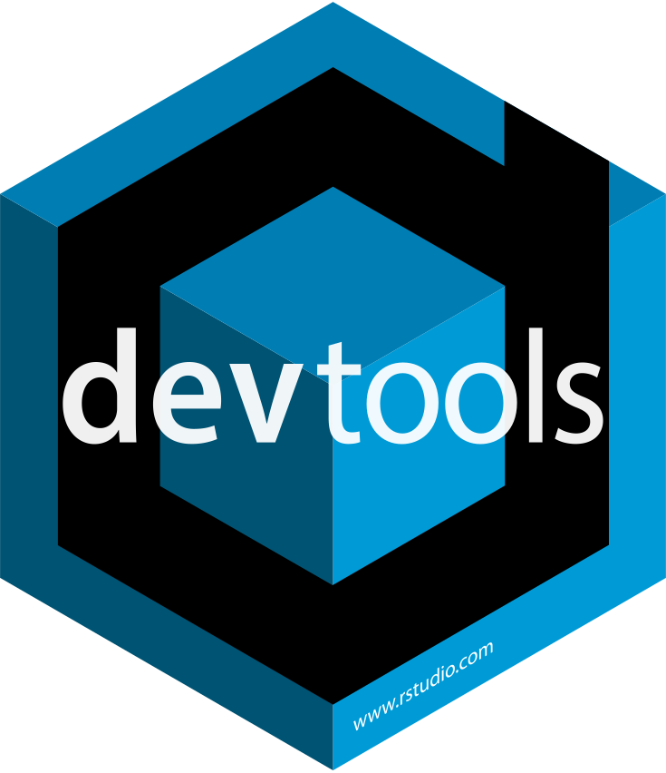
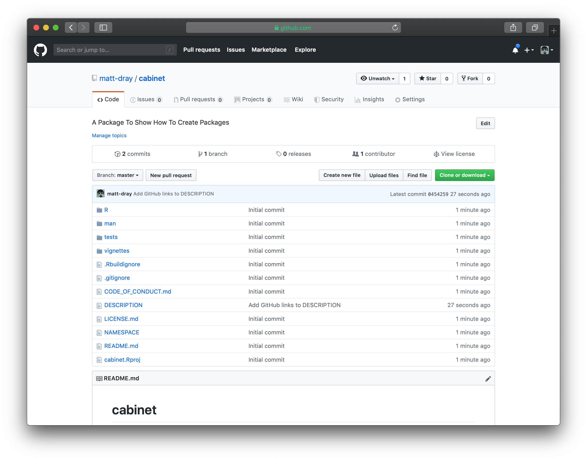
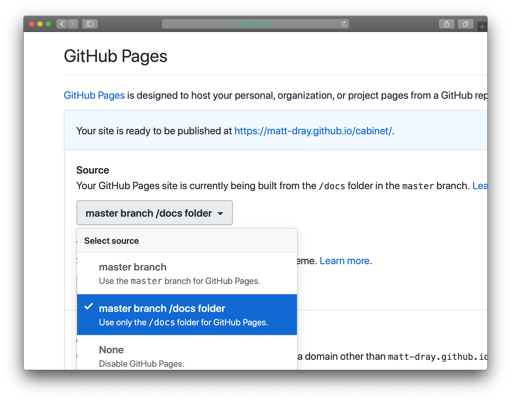
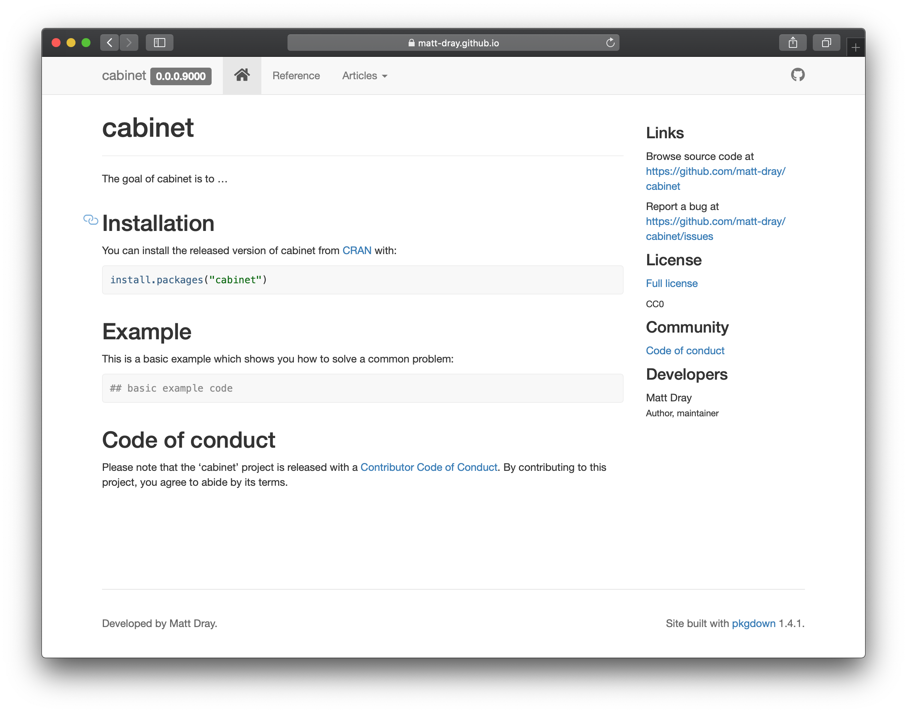

class: title-slide, bottom

.bold[Matt Dray]

Associate Data Scientist

Government Digital Service

[@mattdray](https://www.twitter.com/mattdray) | [rostrum.blog](https://rostrum.blog)
---
class: inverse, middle

Make an R package 

the easy way
???
* What do I mean by easy?
* You can write the whole thing from scratch, which uses multiple files and languages
* Or you can use some shortcuts thanks to some packages
---
class: middle

`r emo::ji("package")`

Goal: create an R package with {usethis} to make the process easier

---
class: middle

Some useful tutorials:

* Hilary Parker's [post](https://hilaryparker.com/2014/04/29/writing-an-r-package-from-scratch/) (beginner)
* Tomas Westlake's [update](https://r-mageddon.netlify.com/post/writing-an-r-package-from-scratch/) (beginner)
* Karl Broman's [site](https://kbroman.org/pkg_primer/) (intermediate)
* Hadley Wickham's [book](http://r-pkgs.had.co.nz/) (intermediate/advanced)

---
class: middle

But first: name these cats
<center></center>
???
* Ossie (left) and Evie (right): the Cabinet Office cats
* It will become obvious why I've mentioned this
---
class: middle

`r emo::ji("raising_hand")`

Who has:

* used R?
* written a function?
* written a package?
---
class: inverse, middle

Let's get #deep
---
class: middle

What _is_ a function?

Why make one?
???
* A command that does a thing, like `read.csv()`
* Provide arguments to inform its behaviour, like `read.csv(file = "data.csv")`
* Prevents you repeating yourself and abstracts away a bunch of code
* You can write your own functions with the `function() {}` syntax
---
class: middle

What _is_ a package?

Why make one?
???
* A collection of functions (usually)
* Practically, it's a folder containing code, documentation and some other special files in a particular format
* Themed to perform certain type of task (usually), like plotting
* Shareable (via a GitHub repository, published on CRAN, or even as a zipped folder)
* You can write your own packages, but 
---
class: inverse, middle
background-image: url("img/hex_small.jpg")
background-size: cover
???
* Some packages are built into R already; you can install more
* Examples: {readr} to read files, {parsnip} for model fitting, {xaringan} to create slides
* Image by Amelia McNamara
---
class: inverse, middle

Minimal package example
???
* Let's build a simple, (nearly) pointless package to illustrate the process
* It's going to start out _very_ simple; just a single function
* It won't even have full documentation, but we'll add it later
---
class: middle

Packages to help make packages

```{r eval=FALSE}
install.packages("devtools", "usethis")

library(devtools)
library(usethis)
```
<center></center>
???
* {devtools} is a general purpose package for developing packages
* {usethis} is a package of functions for setting up your own package
---
class: middle

Create package folder and files `r emo::ji("new")`

```{r eval=FALSE}
usethis::create_package("~/Desktop/cabinet")

# ✔ Setting active project to '/Users/matthewdray/Desktop/cabinet'
# ✔ Creating 'R/' #<<
# ✔ Creating 'man/' #<<
# ✔ Writing 'DESCRIPTION' #<<
# ✔ Writing 'NAMESPACE' #<<
# ✔ Writing 'cabinet.Rproj'
# ✔ Adding '.Rproj.user' to '.gitignore'
# ✔ Adding '^cabinet\\.Rproj$', '^\\.Rproj\\.user$' to '.Rbuildignore'
# ✔ Opening new project 'cabinet' in RStudio #<<
```
???
* A package is a folder containing a bunch of files; `create_package()` creates these for you
* Some of the files contain the functions, other files are for documentation, for example
* If you run the line from within RStudio, it automatically creates an RStudio (.Rproj) file for your new package and opens it
* I'm using the `package::function()` convention throughout so you know what package each function is from
---
class: middle

The resulting file structure

```{r eval=FALSE}
cabinet/
  ├── man/
  ├── R/  #<<
  ├── cabinet.Rproj
  ├── DESCRIPTION  #<<
  └── NAMESPACE
```
???
* This is the basic package folder skeleton created by `create_package()`
* We can add to/edit `R/` and `DESCRIPTION`
# `R/` is where our function scripts will go
* `DESCRIPTION` is where information about the package goes
* Don't touch `man/` and `NAMESPACE`; we can use functions later to fill these for us
* `man/` is where documentation (in a special format) will live
* `NAMESPACE` is a sort-of 'lookup' for object names
* There were some hidden files added too (`.gitignore` and `.buildignore` that we don't need to worry about now)
---
class: middle

Create a script file for functions

```{r eval=FALSE}
usethis::use_r("felines")

# ● Modify 'R/felines.R'
```
???
* Obviously we need to add functions to our package
* They go in R script files in the `R/` folder
* `use_r()` creates a script file with the provided string argument as its name
* It will open automatically in RStudio
* You would typically create multiple script files, where functions with the same 'theme' go in the same script file
---
class: middle

Script added to `R/`!

```{r eval=FALSE}
cabinet/
  ├── man/
  ├── R/
  |   └── felines.R #<<
  ├── cabinet.Rproj
  ├── DESCRIPTION
  └── NAMESPACE
```
---
class: middle

Add functions to `R/felines.R` `r emo::ji("technologist")`

```{r eval=FALSE}
cabinet_cat <- function(name) {

  stopifnot(is.character(name))
  
  if (name %in% c("Ossie", "Evie")) {
    print(paste(name, "is a good Cabinet Office kitty."))
  } else if (name %in% c("Palmerston", "Larry", "Gladstone")) {
    print(paste(name, "isn't a Cabinet Office cat!"))
  } else {
    print("You've much to learn about government cats.")
  }

}
```
???
* Just going to add one silly one now
* This isn't function-writing best practice, but will do for now
* What does this function do?
---
class: middle

Document it `r emo::ji("document")`

```{r eval=FALSE}
devtools::document()

# Updating cabinet documentation
# Updating roxygen version in /Users/matthewdray/Desktop/cabinet/DESCRIPTION
# Writing NAMESPACE #<<
# Loading cabinet
```
???
* The only real change here is the addition of the function to the `NAMESPACE`
* Which allows the function to be exposed to the user
---
class: middle

Use the function! `r emo::ji("cat2")`

```{r eval=FALSE}
cabinet_cat("Ossie")

# Ossie is a good Cabinet Office kitty.

cabinet_cat("Gladstone")

# Gladstone isn't a Cabinet Office cat!

cabinet_cat("Garfield")

# You've much to learn about government cats.
```
???
* We could stop here, but this isn't that useful
* What's missing?
* Obviously more functions, but also the documentation for them
* People can't use the functions if they don't know what they do or how to use them
---
class: inverse, middle

Add internal documentation
???
* What do I mean by internal documentation?
* I mean the documentation that can be accessed throgh the package with `help(function)` or `?function`
---
class:middle

Basic approach:

1. Write text in certain places
1. Run `devtools::document()`
1. `.Rd` file generated
1. Call `?function_name` as needed
---
class: middle

Add documentation for:

* the package by editing `DESCRIPTION`
* each function by editing `.R` files
---
class: middle

Edit the `DESCRIPTION`

```{r eval=FALSE}
Package: cabinet
Title: A Package To Show How To Create Packages #<<
Version: 0.0.0.9000
Authors@R: #<<
    person(given = "Matt", #<<
           family = "Dray", #<<
           role = c("aut", "cre"), #<<
           email = "matthew.dray@digital.cabinet-office.gov.uk") #<<
Description: A package created for a Cabinet Office Coffee & Coding #<<
    session that doesn't do anything useful in particular. #<<
License: What license it uses
Encoding: UTF-8
LazyData: true
RoxygenNote: 6.1.1
```
???
* The `DESCRIPTION` file describes the package: what, who, etc
* You can adapt and add to this template
* For now, just update the highlighted lines
* This will be turned into documentation that will say what the package does
---
class: middle

Start documenting the package by altering the `DESCRIPTION`

```{r eval=FALSE}
usethis::use_package_doc()

# ✔ Writing 'R/cabinet-package.R'

devtools::document()

# Updating cabinet documentation
# Loading cabinet
# Writing cabinet-package.Rd #<<
```
---
class: middle

An `.Rd` was generated in `man/`!

```{r eval=FALSE}
cabinet/
  ├── man/
  |   └── cabinet-package.Rd #<<
  ├── R/
  |   ├── cabinet-package.R #<<
  |   └── felines.R
  ├── cabinet.Rproj
  ├── DESCRIPTION
  └── NAMESPACE
```
???
* .Rd files are the ones that R interprets as documentation
* These are generated when we run `devtools::document()`
* It turns the format of the `DESCRIPTION` file into the format in an `.Rd`
---
class: middle

A peek at the `.Rd` file

```{r eval=FALSE}
% Generated by roxygen2: do not edit by hand #<<
% Please edit documentation in R/cabinet-package.R #<<
\docType{package}
\name{cabinet-package}
\alias{cabinet}
\alias{cabinet-package}
\title{cabinet: A Package To Show How To Create Packages}
\description{
A package created for a Cabinet Office Coffee & Coding
    session that doesn't do anything useful in particular.
}
\author{
\strong{Maintainer}: Matt Dray \email{matthew.dray@digital.cabinet-office.gov.uk}

}
\keyword{internal}
```
???
* It would've been a pain to write this by hand
* The `.Rd` extension is 'roxygen documentation'
* It's in a kind of LaTeX implementation
* This is what the `DESCRIPTION` file was converted to so it can be rendered as a help page
---
class: middle

Add roxygen comments above functions

```{r}
#' @title Check For A Cabinet Office Cat
#' @description Check whether a name belongs to one of the cats from the UK
#'     government's Cabinet Office.
#' @param name A cat name provided as a character string.  #<<
#' @export  #<<
#' @examples
#' cabinet_cat("Evie")

cabinet_cat <- function(name) {
  
  stopifnot(is.character(name))
  
  if (name %in% c("Ossie", "Evie")) {
    print(paste(name, "is a good Cabinet Office kitty."))
  } else if (name %in% c("Palmerston", "Larry", "Gladstone")) {
    print(paste(name, "isn't a Cabinet Office cat!"))
  } else {
    print("You've much to learn about government cats.")
    
  }
}
```
???
* Add these lines above the function in `R/felines.R`
* Possibly the trickiest part of the process, because you may not have seen roxygen before
* Special comment block (`#'`) followed by `@thing` to provide info about the function
* Includes title (`@title`), description (`@description`), the arguments (`@param`), etc
* `@export` is included so that the function is made available to package users (yes, you can have internal package functions that are never exposed to a user!)
* Other sections that can be added, but we won't worry about those now
---
class: middle

And `document()` again

```{r eval = FALSE}
devtools::document()

# Updating cabinet documentation
# Loading cabinet
# Writing NAMESPACE
# Writing cabinet_cat.Rd  #<<
```
---
class: middle

The roxygen was also converted to `.Rd`

```{r eval=FALSE}
cabinet/
  ├── man/
  |   ├── cabinet-package.Rd
  |   └── cabinet_cat.Rd #<<
  ├── R/
  |   ├──cabinet-package.R
  |   └── felines.R
  ├── cabinet.Rproj
  ├── DESCRIPTION
  └── NAMESPACE
```
---
class: middle

Now you can see documentation

```{r eval=FALSE}
?cabinet_cat

# Rendering development documentation for 'cabinet_cat'
```
<center></center>
???
* This will appear in the 'help' pane of RStudio
* Now people can see what the function is for
* And see what the arguments are and how to use it
---
class: inverse, middle

Add longer-form documentation
???
* A README (general package introduction, how to install, etc; useful for GitHub landing page)
* Focussed vignettes to explain how to do particular tasks
---
class: middle

Add a README `r emo::ji("memo")`

```{r eval=FALSE}
usethis::use_readme_md()

# ✔ Writing 'README.md'
# ● Modify 'README.md' #<<
```
???
* This is added to the project home directory
* It's partially pre-filled to give you an idea of what the content should be
* File will open automatically in RStudio for editing
* I've called this 'external' because it gets rendered nicely as a sort of 'homepage' for the package on GitHub
---
class: middle

Add walkthrough vignettes

```{r eval=FALSE}
usethis::use_vignette("Check cat names")

# ✔ Adding 'knitr' to Suggests field in DESCRIPTION #<<
# ✔ Setting VignetteBuilder field in DESCRIPTION to 'knitr'
# ✔ Adding 'rmarkdown' to Suggests field in DESCRIPTION #<<
# ✔ Creating 'vignettes/'
# ✔ Adding '*.html', '*.R' to 'vignettes/.gitignore'
# ✔ Adding 'inst/doc' to '.gitignore'
# ✔ Creating 'vignettes/check-cat-names.Rmd'
# ● Modify 'vignettes/check-cat-names.Rmd' #<<
```
???
* This creates an R Markdown file in `vignettes/`
* Adds packages for rendering the R Markdown file to 'Suggests' in the `DESCRIPTION`
* File will open automatically in RStudio for editing
* Vignettes are arguably 'internal', but we're going to expose them on the internet
---
class: middle

You guessed it

```{r eval=FALSE}
devtools::document()

# Updating cabinet documentation
# Writing NAMESPACE
# Loading cabinet
# Writing NAMESPACE
```
---
class: middle

The new documentation will help people use the package

```{r eval=FALSE}
cabinet/
  ├── man/
  |   ├── cabinet-package.Rd
  |   └── cabinet_cat.Rd
  ├── R/
  |   ├── cabinet-package.R
  |   └── felines.R
  ├── vignettes/ #<<
  |   └── check-cat-names.Rmd #<<
  ├── cabinet.Rproj
  ├── DESCRIPTION
  ├── NAMESPACE
  └── README.md #<<
```
---
class: inverse, middle

Add packages to your package
???
* I only used base functions in the package
* What if I want to refer to functions from other packages?
---
class: middle

Let's use {glue} instead of `paste()`

```{r eval=FALSE}
cabinet_cat <- function(name) {
  
  stopifnot(is.character(name))
  
  if (name %in% c("Ossie", "Evie")) {
    print(glue::glue("{name} is a good Cabinet Office kitty.")) #<<
  } else if (name %in% c("Palmerston", "Larry", "Gladstone")) {
    print(glue:glue("{name} isn't a Cabinet Office cat!")) #<<
  } else {
    print("You've much to learn about government cats.")
  }
  
}
```
???
* Use the `package::function` convention
---
class: middle

Add {glue} to the package

```{r eval=FALSE}
usethis::use_package("glue")

# ✔ Adding 'glue' to Imports field in DESCRIPTION #<<
# ● Refer to functions with `glue::fun()`
```
---

Package name added to 'Imports' in `DESCRIPTION`

```{r eval=FALSE}
Package: cabinet
Title: A Package To Show How To Create Packages
Version: 0.0.0.9000
Authors@R:
    person(given = "Matt",
           family = "Dray",
           role = c("aut", "cre"),
           email = "matthew.dray@digital.cabinet-office.gov.uk")
Description: A package created for a Cabinet Office Coffee & Coding 
    session that doesn't do anything useful in particular.
License: What license it uses
Encoding: UTF-8
LazyData: true
RoxygenNote: 6.1.1
Imports: #<<
    glue #<<

```
???
* So {glue} wil be installed when {cabinet} is installed
* If the package isn't on CRAN, you can use 'Remotes' instead of 'Imports'
* You don't always want to install things on someone else's machine
* You can use 'Suggests' to suggest packages instead
* {testthat} is often suggested because it's not usually used in user-facing functions
---
class: inverse, middle

Test your functions
???
* This session isn't about testing
* But you can set up testing for your files quickly with {usethis} 
* You want to make sure that your functions behave as intended
---
class: middle

Create directory structure for {testhat}

```{r eval=FALSE}
usethis::use_testthat()

# ✔ Adding 'testthat' to Suggests field in DESCRIPTION #<<
# ✔ Creating 'tests/testthat/'  #<<
# ✔ Writing 'tests/testthat.R'
```

Create a test file

```{r eval=FALSE}
usethis::use_test("felines")

# ✔ Writing 'tests/testthat/test-felines.R'
# ● Modify 'tests/testthat/test-felines.R'  #<<
```
???
* {testthat} is a package for writing tests
* Group your tests into logical groups
* We've only got one function to test right now
* The new test file opens automatically
---
class: middle

Add a test to `R/test-felines.R` `r emo::ji("check")`

```{r eval=FALSE}
context("test-felines")

test_that("numeric input causes error", {
  expect_error(cabinet::cabinet_cat(1))
})
```
???
* What do you think this test does?
* Write more tests to cover as many possibilities as possible
* And to cover as much of the code as possible
---
class: middle

Run the tests `r emo::ji("ok")`

```{r eval=FALSE}
devtools::test()

# Loading cabinet
# Testing cabinet
# ✔ | OK F W S | Context
# ✔ |  1       | test-felines [0.1 s]
# 
# ══ Results ═════════════════════════════════
# Duration: 0.1 s
# 
# OK:       1
# Failed:   0
# Warnings: 0
# Skipped:  0
```
---
class: middle

Here's what the package section of the `DESCRIPTION` looks like now

```{r eval=FALSE}
Suggests: #<<
    knitr, #<<
    rmarkdown, #<<
    testthat #<<
VignetteBuilder: knitr #<<
Imports:
    glue
```
---
class: inverse, middle

Share the package
???
* This session isn't about Git and GitHub
* But we can put the package under version control and add it to GitHub
* All without writing any Git code and with minimal navigation of GitHub
* Requires a GitHub account
---
class: middle

Add a license and code of conduct for interacting with your package

```{r eval=FALSE}
usethis::use_cc0_license("Matt Dray")

# ✔ Setting License field in DESCRIPTION to 'CC0'
# ✔ Writing 'LICENSE.md'  #<<
# ✔ Adding '^LICENSE\\.md$' to '.Rbuildignore'
```

```{r eval=FALSE}
usethis::use_code_of_conduct()

# ✔ Writing 'CODE_OF_CONDUCT.md'
# ✔ Adding '^CODE_OF_CONDUCT\\.md$' to '.Rbuildignore'
# ● Don't forget to describe the code of conduct in your README: #<<
# Copying code to clipboard:
#   Please note that the 'cabinet' project is released with a [Contributor Code of Conduct](CODE_OF_CONDUCT.md). By contributing to this project, you agree to abide by its terms.
```
???
* If we're going to share our package, we should set a license and a code of conduct
* License so people know how to reuse our code
* Code of conduct so people know how to behave
---
class: middle

Initiate Git, make first commit 

```{r eval=FALSE}
usethis::use_git()

# ✔ Initialising Git repo
# ✔ Adding '.Rhistory', '.RData' to '.gitignore'
# OK to make an initial commit of 8 files?  #<<
# 1: Yes
# 2: No way
# 3: Absolutely not

Selection: 1

# ✔ Adding files and committing
# ● A restart of RStudio is required to activate the Git pane
# ● Restart now?
# 1: Not now
# 2: Negative
# 3: Yup

Selection: 3
```
???
* Can do `usethis::use_git_ignore(".DS_Store")` to add stuff to gitignore
---
class: middle

Configure a Personal Access Token to access the GitHub API `r emo::ji("ticket")`

```{r eval=FALSE}
usethis::browse_github_pat()

# ✔ Opening URL https://github.com/settings/tokens/new?scopes=repo,gist&description=R:GITHUB_PAT
# ● Call `edit_r_environ()` to open '.Renviron' and store your PAT with a line like:
#   GITHUB_PAT=xxxyyyzzz
# ● Make sure '.Renviron' ends with a newline!

usethis::edit_r_environ()

# ● Modify '/Users/matthewdray/.Renviron'
# ● Restart R for changes to take effect
```
???
* I've already added a PAT to my `.Renviron`
---
class: middle

Push the package to GitHub `r emo::ji("cloud")`

```{r eval=FALSE}
usethis::use_github(protocol = "https")

# ● Check title and description
#   Name:        cabinet
#   Description: A Package To Show How To Create Packages
# Are title and description ok? #<<
# 1: Not now
# 2: Definitely
# 3: No way

Selection: 2

# ✔ Creating GitHub repository #<<
# ✔ Adding GitHub remote
# ✔ Adding GitHub links to DESCRIPTION #<<
# ✔ Setting URL field in DESCRIPTION to 'https://github.com/matt-dray/cabinet' #<<
# ✔ Setting BugReports field in DESCRIPTION to 'https://github.com/matt-dray/cabinet/issues'
# ✔ Pushing to GitHub and setting remote tracking branch
# ✔ Opening URL https://github.com/matt-dray/cabinet
```
---
class: middle


---
class: middle

Now it's available to everyone! `r emo::ji("tada")`

```{r eval=FALSE}
install.packages("remotes")
remotes::install_github("matt-dray/cabinet")
```
???
* {remotes} contains functions for installing packages from remote sources (e.g. GitHub)
* Supply a string in the form `"username/package"`
* You can also use it to install from local sources (i.e. a package folder on your machine)
---
class: inverse, middle

Publicise!
---
class: middle

Install {pkgdown} for website

```{r eval=FALSE}
install.packages("pkgdown")
library(pkgdown)
```

<center></center>
???
* The ultimate external reference for your package
* Your documented files are spun into a website that you can host on github.io from a GitHub repo, for example
---
class: middle

Generate website files in `docs/`

```{r eval=FALSE}
pkgdown::build_site()

# ── Installing package into temporary library ──────────────────────────────────────
# ══ Building pkgdown site ══════════════════════════════════════════════════════════
# Reading from: '/Users/matthewdray/Desktop/cabinet'
# Writing to:   '/Users/matthewdray/Desktop/cabinet/docs'
# ── Initialising site ──────────────────────────────────────────────────────────────
# Copying '../../../../Library/Frameworks/R.framework/Versions/3.5/Resources/library/pkgdown/assets/docsearch.css' to 'docsearch.css'
# 
# [truncated]
# 
# ── Building articles ──────────────────────────────────────────────────────────────
# Writing 'articles/index.html'
# Reading 'vignettes/check-cat-names.Rmd'
# Writing 'articles/check-cat-names.html'
# ══ DONE ═══════════════════════════════════════════════════════════════════════════
# ── Previewing site ────────────────────────────────────────────────────────────────
```
---
class: middle

Push changes and go to repo settings

<center><center>
---
class: middle

We have a live website `r emo::ji("champagne")`

<center><center>
---
class: inverse, middle

Recap

---
class: middle

So, we:

* created a package from scratch
* documented it internally
* wrote some long-form documentation
* set up tests
* set up version control
* made it available openly on GitHub
* built a website for it
---
class: middle

Final folder structure

```{r eval=FALSE}
cabinet/
  ├── .gitignore
  ├── .buildignore
  ├── cabinet.Rproj
  ├── DESCRIPTION #<<
  ├── docs/
  ├── man/ #<<
  ├── NAMESPACE #<<
  ├── R/ #<<
  ├── tests/
  ├── README.md
  └── vignettes/
```
???
* This grew from the basic `DESCRIPTION`, `NAMESPACE`, `R/` and `man/`
* But we didn't really have to think about it; we used {usethis} to help
---
class: title-slide, bottom

.bold[Thanks!]

<br>

Matt Dray

[@mattdray](https://www.twitter.com/mattdray) | [rostrum.blog](https://rostrum.blog)